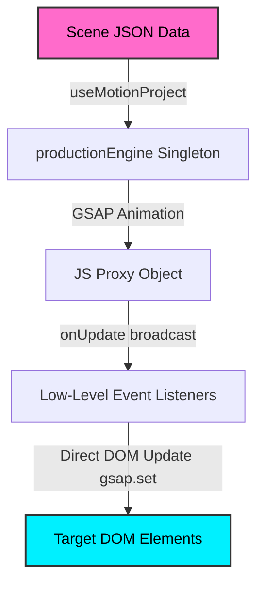

# React Motion Path Engine (Data-First & Zero Re-render)

A high-performance React and GSAP-based animation engine built with a **"Data-First"** and **"Progress-Driven Pub/Sub"** philosophy. The engine runs autonomously outside React's render cycles (**Zero Re-renders**), ensuring a consistent 60fps for both Scroll-Driven and Time-Driven animations.

---

## 1. Project Directory Structure

```
d:/dev/motionpath/
├── package.json              # Project configuration and dependency declarations
├── vite.config.js            # Vite bundler configuration
├── index.html                # Main entry point for browser rendering
├── prd.md                    # Product Requirement Document (Indonesian)
├── rules.md                  # Strict styling, memory leak prevention, and performance rules
├── schema.md                 # Original JSON Schema documentation
├── src/
│   ├── main.jsx              # Application entry point
│   ├── App.jsx               # Layout containing all interactive animation demos
│   ├── App.css               # Curated premium theme, layout styles, and animations
│   ├── hooks/
│   │   ├── useMotionProject.js    # React Hook: Headless project initializer
│   │   ├── useMotionSubscriber.js # React Hook: Low-overhead direct DOM update subscriber
│   │   ├── useMotionTrigger.js    # React Hook: Registers trigger element target DOM refs
│   │   ├── useMotionTimelinePlayback.js # React Hook: Ongoing play/pause timeline control
│   │   └── __tests__/             # Unit tests for Hooks
│   │       ├── useMotionProject.test.js
│   │       ├── useMotionSubscriber.test.js
│   │       └── useMotionTimelinePlayback.test.js
│   └── lib/
│       ├── ProductionEngine.js    # Production-facing engine singleton
│       ├── EditorEngine.js        # Editor-facing engine with Manual Playback controls
│       ├── compileProject.js      # Shared preamble compiler (validate -> build -> EngineCore)
│       ├── engineCore.js          # Shared subscription & compose core
│       ├── builder.js             # Compiles schema keyframes and merges plugin patches
│       ├── deferredCall.js        # Generalized buffer/queue for subscribers and timers
│       ├── pathMath.js            # Quadratic/Cubic Bezier curve calculations
│       ├── pathUtils.js           # Math curve interpolation and SVG DOM helpers
│       ├── plugins.js             # Engine plugin registry
│       ├── plugins/               # Custom animation plugins directory (opacity, path, filter, etc.)
│       ├── projection3d.js        # 3D-to-2D perspective projection math and generators
│       └── __tests__/             # Unit tests for core library functions
│           └── ...
```

---

## 2. Core Architecture Philosophy



1. **Zero React Re-render**: Animating positions at 60fps through React's Virtual DOM diffing causes significant performance overhead. Instead, React components subscribe to events and apply properties directly to DOM nodes using imperatively styled wrappers (`gsap.set`).
2. **Polymorphic Scheduling**: The engine automatically orchestrates scenes triggered by scrolling (`trigger.type: "scroll"` using GSAP ScrollTrigger) or automated timers (`trigger.type: "time"` using standard GSAP timelines).
3. **Data-First**: Motion paths, durations, delays, and repeat configurations are fully serialized in a JSON schema. Visual styles (scale, opacity, blur) are computed dynamically by subscribers based on normalized progress (0.0 to 1.0) and spatial properties.
4. **Z-axis Depth Support**: The engine natively parses and interpolates `z` and control points (`ctrlZ`). It supports projecting 3D paths to a 2D viewport utilizing standard trigonometric perspective projection.

---

## 3. AI & Developer Cheat Sheet: Capability Bounds

This section contains strict operational bounds and execution patterns. **Read this to instantly evaluate if a requested scenario is possible and how to structure it.**

### A. Engine Capabilities Matrix

| What the Engine CAN Do | What the Engine CANNOT Do |
|---|---|
| **Multiple Scenarios**: Load scroll-scrub triggers and time-based triggers inside the same project. | **Duplicate Target IDs**: You cannot target the same element ID across two different scenarios (e.g. scroll and time). The last scenario loaded will clobber the elements map entry. |
| **Declarative Loops in Observers**: Configure infinite loops (`repeat: -1, yoyo: true`) on scroll-observer scenarios. | **Scrub Loops**: You cannot loop a scroll-scrub animation (`repeat` is illegal on scrub triggers). Scrub progress is strictly a function of scroll position. |
| **Component-Level Play Control**: Pause individual time-based scenarios on load, and play/pause them later via React state. | **React Render Control**: You cannot use React state to drive style changes at 60fps. React should only be used to toggle high-level states (like play/pause). |
| **Compose Transforms**: Animate multiple axes on a single visual entity by using nested DOM wrappers (Parent/Child). | **Native Speed-to-Scroll Velocity Mapping**: The engine cannot natively scale animation speed matching scroll velocity yet (must be handled manually or wait for Option 4). |

### B. Hook & Subscription Execution Contract

1. **The Active Ref Requirement**:
   `useMotionSubscriber(elementId, ref, callback)` will **bail out immediately** and ignore the callback if `ref.current` is null. 
   - *Consequence*: You cannot register a "ghost" subscriber on an empty ref to listen to scroll progress. To monitor progress, register the subscriber callback on an active visual component that has a real DOM element rendered.
2. **Infinite React Render Loop Prevention**:
   Subscriber callbacks execute on the GSAP update loop (up to 60+ times per second).
   - *Rule*: Never call a state setter (e.g., `setState`) inside a subscriber callback without a threshold gate (using a React `useRef` to verify the state has actually changed). If you call `setState` every tick, React will crash with a maximum update depth error.
3. **Timeline Grouping Constraints**:
   Only scenarios of the **identical trigger type** (scrub-with-scrub or time-with-time) may share a `timelineId` group. Scroll observer scenarios cannot be grouped.

---

## 4. Core Modules & Utilities

### A. Engines & Core Orchestration

*   **Production Engine (`src/lib/ProductionEngine.js`)**:
    Exposes a singleton instance `productionEngine` as the default export. This is the production-facing runner that validates schemas, resolves dependencies, wires up ScrollTrigger instances, and triggers timelines.
*   **Editor Engine (`src/lib/EditorEngine.js`)**:
    Enables low-level manual frame scrubbing by exposing `setProgress(target, progress)`. Designed for interactive visual timelines and editors.
*   **Engine Core (`src/lib/engineCore.js`)**:
    Contains the shared Pub/Sub subscription register and handles `compose(elementId, rawData)`. Translates proxy properties into final CSS-ready configurations by querying active plugins.

### B. Builder (`src/lib/builder.js`)

Compiles schema-based keyframes into flat GSAP-compliant target objects:
*   Resolves and loads lazy-loaded plugins (like GSAP SplitText).
*   Merges different keyframe percentage points into deep-merged structures.
*   Enforces collision checks to prevent conflicting eases or duplicate tween declarations.

### C. Path & Mathematical Utilities (`src/lib/pathUtils.js` & `src/lib/pathMath.js`)

Houses all the geometry and Bezier interpolation computations:
*   **`buildMotionPath(pathNodes)`**: Converts path nodes (with optional Bezier controls) to an SVG path string.
*   **`convertToCubicPath(pathNodes)`**: Converts a list of coordinates (containing optional quadratic control points `{ x, y, z?, ctrlX?, ctrlY?, ctrlZ? }`) into a GSAP-compatible cubic Bezier array in the format `[anchor, cp1, cp2, anchor, ...]`.
    *   *Z-axis elevation*: Quadratic curves are elevated to cubic using:
        $$CP1 = P0 + \frac{2}{3}(Q - P0)$$
        $$CP2 = P1 + \frac{2}{3}(Q - P1)$$
*   **`getPointOnCubicPath(cubicPath, progress)`**: Algebraic cubic Bezier interpolator that extracts coordinate $(x,y,z)$ and tangent rotation at any progress without touching the DOM.

### D. 3D Projection (`src/lib/projection3d.js`)

Handles trigonometric projection of coordinates from a 3D coordinate space onto a tilted 2D perspective layout:
*   **`project3DTo2D(x3d, y3d, z3d, cx, cy, tiltDeg, invertTilt = false, perspective = 1000)`**:
    Projects coordinate $(x,y,z)$ centered around $(cx, cy)$ using a tilt angle $\theta$ and a perspective division factor:
    $$\text{scale} = \frac{\text{perspective}}{\text{perspective} - Z}$$
    $$x_{2D} = cx + x_{3D} \times \text{scale}$$
    $$y_{2D} = cy + (y_{3D} \cos(\theta) \pm z_{3D} \sin(\theta)) \times \text{scale}$$
*   **`projectPathNodes3DTo2D(pathNodes, cx, cy, tiltDeg, invertTilt = false, perspective = 1000)`**: Projects an entire array of path nodes (and their quadratic control points) to 2D coordinates so that they can be drawn as SVG path guides via `buildMotionPath()`.

---

## 5. React Hooks API

### A. `useMotionProject` (`src/hooks/useMotionProject.js`)

A headless React hook that loads a schema project:

```javascript
import useMotionProject from './hooks/useMotionProject';

// load project with initial paused states (prevents one-frame flash of motion)
useMotionProject(projectSchema, {
  initialPlayStates: {
    'timeline-id': false // true = playing, false = paused (default for unspecified ids is true)
  }
});
```

*   **Behavior**:
    *   **Auto-Cleanup**: Automatically cleans up and calls `productionEngine.destroy()` on unmount.
    *   **Static Playback Configuration**: Changing `initialPlayStates` after mount has no effect; use `useMotionTimelinePlayback` for dynamic reactive control.

### B. `useMotionTimelinePlayback` (`src/hooks/useMotionTimelinePlayback.js`)

A React hook providing dynamic play/pause timeline control from any component at any level of nesting:

```javascript
import useMotionTimelinePlayback from './hooks/useMotionTimelinePlayback';

// dynamically control play/pause of a time-based scenario
useMotionTimelinePlayback('timeline-id', isPlaying);
```

*   **Behavior**:
    *   Allows individual components to trigger timeline playback state changes based on viewport visibility, hover, or click interactions.
    *   Buffered through the generalized `deferredCall` utility so commands are safely queued if the engine has not yet finished loading.

### C. `useMotionTrigger` (`src/hooks/useMotionTrigger.js`)

A React hook registering a DOM element reference as a trigger or pin target:

```javascript
import { useRef } from 'react';
import useMotionTrigger from './hooks/useMotionTrigger';

const sectionRef = useRef(null);
const stageRef = useRef(null);

useMotionTrigger('pricing-section', sectionRef);
useMotionTrigger('pricing-stage', stageRef);
```

*   **Behavior**:
    *   Decouples the engine from browser DOM querying APIs (removes need for global class selectors or `data-motion-id` attributes).
    *   Registers target nodes in the trigger ref map on mount, and automatically unregisters them on unmount.

### D. `useMotionSubscriber` (`src/hooks/useMotionSubscriber.js`)

Subscribes direct DOM references to coordinate updates:

```javascript
import { useRef, useCallback } from 'react';
import useMotionSubscriber from './hooks/useMotionSubscriber';

const ref = useRef(null);

// Optional: Use progress to map visual styles imperatively
const transformFn = useCallback((rawData, compose) => {
  const composed = compose(rawData);
  return {
    ...composed,
    scale: 0.8 + rawData.pathProgress * 0.4,
    opacity: 1 - Math.abs(rawData.pathProgress - 0.5) * 2,
  };
}, []);

useMotionSubscriber('element-id', ref, transformFn);
```

*   **Behavior**:
    *   Subscribes directly to coordinate broadcasts.
    *   If `transformFn` is provided, applies the returned custom styles. Otherwise, applies the default composed values.
    *   Automatically unsubscribes on unmount.

---

## 6. JSON Scene Schema & Structures

All animation data must follow the TypeScript definitions structured below (extended for 3D/Z support):

```typescript
interface PathNode {
  x: number;
  y: number;
  z?: number;      // Optional, defaults to 0
  ctrlX?: number;  // Quadratic control X (optional)
  ctrlY?: number;  // Quadratic control Y (optional)
  ctrlZ?: number;  // Quadratic control Z (optional)
}

interface Stop {
  p: number; // progress (0..1)
  v: number | string; // value
  ease?: string; // Easing function name (e.g. "power2.out")
}

interface AnimatedProperty {
  stops: Stop[]; // Requires at least 2 entries (explicit start and end)
}

interface PathProperty {
  points: PathNode[];
  stops: Stop[]; // Requires at least 2 entries (explicit start and end)
  autoRotate?: boolean;
}

interface SceneElement {
  id: string; // Unique identifier for the subscriber link
  keyframes: {
    path?: PathProperty;
    [propKey: string]: AnimatedProperty | PathProperty | undefined;
  };
  duration?: number; // Overrides scenario trigger.duration for time/observer patterns
  transformOrigin?: string; // e.g. "50% 50%". Applied via gsap.set before animation
}

interface TriggerScrollScrub {
  type: "scroll";
  scrub: boolean | number;
  trigger?: string; // Selector or data-motion-id reference
  start?: string;
  end?: string;
  pin?: boolean | string;
  pinSpacing?: boolean;
}

interface TriggerScrollObserver {
  type: "scroll";
  scrub: false;
  trigger: string;
  start: string;
  toggleActions: string; // E.g., "play pause resume pause"
  repeat?: number;
  yoyo?: boolean;
  repeatDelay?: number;
}

interface TriggerTime {
  type: "time";
  duration: number;
  repeat?: number;
  yoyo?: boolean;
  repeatDelay?: number;
}

interface Scenario {
  sceneId: string;
  timelineId?: string; // Addressable timeline key for playStates
  primary?: boolean;
  trigger: TriggerScrollScrub | TriggerScrollObserver | TriggerTime;
  stagger?: number;
  elements: SceneElement[];
}

interface MotionProject {
  schemaVersion: number;
  projectId: string;
  perspective?: number; // CSS perspective in px for 3D scenes (e.g. 1000)
  scenarios: Scenario[];
}
```

---

## 7. Core Capabilities & Design Patterns

### A. Play State Control (`options.playStates`)
Time scenarios do not have to auto-play immediately on load. The engine accepts runtime play/pause state directives (via hooks or raw loads).
- **GSAP Nesting Resolution**: Timelines built with `{ paused: true }` are automatically unpaused when appended to a master timeline, allowing parent playback controls to drive child nodes.

### B. Scroll Observer Loops
The engine natively supports non-scrub scroll observers containing looping options (`repeat`, `yoyo`, `repeatDelay`).
- **Use Case**: Starting an infinite animation sequence (e.g., hovering bounce) only when a specific scroll container enters the viewport.

### C. Wrapper/Inner Animation Composition
To prevent different timelines from clobbering coordinates (e.g. two separate scenarios moving the same item along the `y` axis):
- Map the scroll-scrub translation to a parent container element (`lantern-1-wrap`).
- Map the time-based loop translation to the inner visual element (`lantern-1`).
- CSS naturally stacks these transforms without property clobbering.

---

## 8. Practical Showcase Examples (In `src/App.jsx`)

1.  **ScrollDemo**: Low-friction timeline scrubbing showing rockets trailing along a dashed SVG track.
2.  **CarouselDemo**: Horizontal glassmorphic cards moving on an S-curve track, tilting based on local path tangents.
3.  **HelixDemo**: Scroll-controlled 3D vertical spring scaling and rotating cards around a cylinder axis.
4.  **GrowthDemo**: 3D Z-depth scaling diagonally along a tilted 3D Bezier curve from $Z = -300$ to $Z = 300$.
5.  **Pasar Malam (`/pasarmalam`)**: Pinned scrollytelling page with frame-by-frame preloaded WebP sequence playback, live stats counter updates outside React render loops, and stateful React-gated lantern bounce.
6.  **Pasar Malam Observer (`/pasarmalam-observer`)**: Stateless version of the Pasar Malam page driving the scroll entry and infinite hover bounce entirely in the JSON schema triggers via `scroll-observer` scroll-threshold crossings.

---

## 9. Future Wishlist (Unimplemented Capabilities)

*   **Native Velocity-Based Speed Scaling (`timeScale` mapping)**:
    Provide a declarative trigger setting (`velocityScale: { sensitivity, damping, mode }`) allowing the engine to automatically speed up, slow down, or freeze time-based timelines based on the scroll velocity (`ScrollTrigger.getVelocity()`) without writing custom event listeners or stateful React hooks.
*   **Engine vs. Player Architectural Split**:
    Decouple the current hybrid `ProductionEngine` into a pure **`MotionEngine`** (encapsulating compilation, validation, and subscriber rendering) and a pluggable **`MotionPlayer`** (handling viewport scroll listeners, ScrollTriggers, and playhead states). This allows identical compiled projects to be run in different modes (e.g. `ScrollPlayer`, `TimePlayer`, `EditorPlayer`) without modifying the core rendering system.
*   **Sequential Stagger Overlaps**:
    Support declarative delay offsets within staggered group timelines (`staggerOffset` or overlap offsets) instead of purely strict sequential spacing.
*   **TypeScript Migration (Public Schema & Hooks API)**:
    Migrate hook declarations and JSON schema interfaces to TypeScript. While runtime JS validators remain necessary for dynamic JSON, TS interfaces will provide compile-time schema correctness checks and IDE autocompletion for `useMotionSubscriber` callbacks.

---

## 10. Testing & Verification

The suite runs **198 unit tests** using **Vitest** covering edge cases, curve configurations, play-state overrides, pub/sub event distributions, caching, and 3D projection formulas.

To execute tests:
```bash
npm test
```
To run tests with code coverage or interactive UI:
```bash
npx vitest
```

