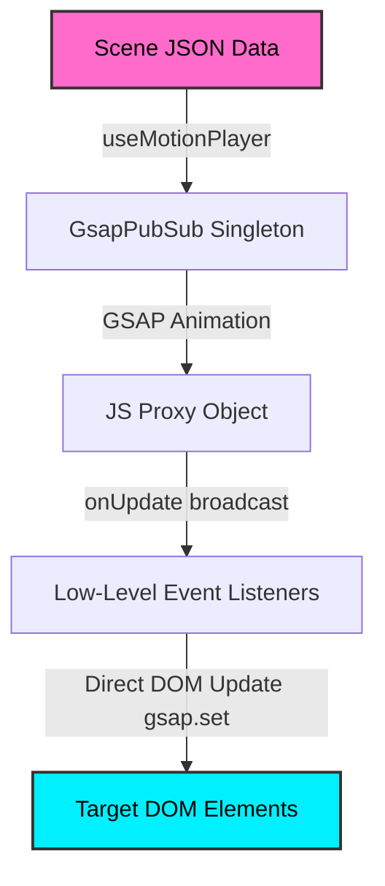

# React Motion Path Engine (Data-First & Zero Re-render)

A high-performance React and GSAP-based animation engine built with a **"Data-First"** and **"Progress-Driven Pub/Sub"** philosophy. The engine runs autonomously outside React's render cycles (**Zero Re-renders**), ensuring a consistent 60fps for both Scroll-Driven and Time-Driven animations.

---

## 1. Project Directory Structure

```
d:/dev/motionpath/
├── package.json              # Project configuration and dependency declarations
├── vite.config.js            # Vite bundler configuration
├── index.html                # Main entry point for browser rendering
├── prd.md                    # Product Requirement Document (Indonesian)
├── rules.md                  # Strict styling, memory leak prevention, and performance rules
├── schema.md                 # Original JSON Schema documentation
├── src/
│   ├── main.jsx              # Application entry point
│   ├── App.jsx               # Layout containing all interactive animation demos
│   ├── App.css               # Curated premium theme, layout styles, and animations
│   ├── hooks/
│   │   ├── useMotionPlayer.js     # React Hook: Headless scene initializer
│   │   ├── useMotionSubscriber.js # React Hook: Low-overhead direct DOM update subscriber
│   │   └── __tests__/             # Unit tests for Hooks
│   │       ├── useMotionPlayer.test.js
│   │       └── useMotionSubscriber.test.js
│   └── lib/
│       ├── motionEngine.js        # Core GsapPubSub singleton class orchestration
│       ├── pathUtils.js           # Math curve interpolation and SVG DOM helpers
│       ├── projection3d.js        # 3D-to-2D perspective projection math and generators
│       └── __tests__/             # Unit tests for core library functions
│           ├── motionEngine.test.js
│           ├── pathUtils.test.js
│           └── projection3d.test.js
```

---

## 2. Core Architecture Philosophy



1. **Zero React Re-render**: Animating positions at 60fps through React's Virtual DOM diffing causes significant performance overhead. Instead, React components subscribe to events and apply properties directly to DOM nodes using imperatively styled wrappers (`gsap.set`).
2. **Polymorphic Scheduling**: The engine automatically orchestrates scenes triggered by scrolling (`triggerType: "scroll"` using GSAP ScrollTrigger) or automated timers (`triggerType: "timer"` using standard GSAP timelines).
3. **Data-First**: Motion paths, durations, delays, and repeat configurations are fully serialized in a JSON schema. Visual styles (scale, opacity, blur) are computed dynamically by subscribers based on normalized `progress` (0.0 to 1.0) and spatial properties.
4. **Z-axis Depth Support**: The engine natively parses and interpolates `z` and control points (`ctrlZ`). It supports projecting 3D paths to a 2D viewport utilizing standard trigonometric perspective projection.

---

## 3. Core Modules & Utilities

### A. The Motion Engine (`src/lib/motionEngine.js`)

Exposes a singleton instance of the `GsapPubSub` class as the default export. This class manages all active tweens, timelines, scroll triggers, cache states, and low-level subscriber lists:

*   **`GsapPubSub` Class**:
    *   `initScene(sceneData, containerEl)`: Boots up a scene. Cancels and cleans up existing scenes with matching IDs to prevent visual duplicate glitches or leaks.
    *   `subscribe(elementId, callback)`: Attaches a callback listener. Contains a **caching mechanism** that immediately fires the last cached coordinates to late subscribers, eliminating visual "jumping" bugs.
    *   `_broadcast(elementId, data)`: Informs subscribers of changes with `{ x, y, z, rotation, progress }` updates.
    *   `destroyScene(sceneId)`: Unbinds tweens, timelines, scroll triggers, and clears elements from the cache.

### B. Path & Mathematical Utilities (`src/lib/pathUtils.js`)

Houses all the geometry and Bezier interpolation computations:

*   **`buildMotionPath(pathNodes)`**: Converts path nodes (with optional Bezier controls) to an SVG path string.
*   **`convertToCubicPath(pathNodes)`**: Converts a list of coordinates (containing optional quadratic control points `{ x, y, z?, ctrlX?, ctrlY?, ctrlZ? }`) into a GSAP-compatible cubic Bezier array in the format `[anchor, cp1, cp2, anchor, ...]`.
    *   *Z-axis elevation*: Quadratic curves are elevated to cubic using:
        $$CP1 = P0 + \frac{2}{3}(Q - P0)$$
        $$CP2 = P1 + \frac{2}{3}(Q - P1)$$
    *   *Defaults*: `z` values default to `0`. `ctrlZ` defaults to the midpoint of the adjacent `z` values.
*   **`getPointOnCubicPath(cubicPath, progress)`**: Algebraic cubic Bezier interpolator that extracts coordinate $(x,y,z)$ and tangent rotation at any progress without touching the DOM.
*   **`getPointOnPath(pathEl, progress, offset = 0)`**: Samples exact $(x,y)$ coordinates and calculates the tangent rotation angle (in degrees) at a given progress along an SVG path.

### C. 3D Projection (`src/lib/projection3d.js`)

Handles trigonometric projection of coordinates from a 3D coordinate space onto a tilted 2D perspective layout:

*   **`project3DTo2D(x3d, y3d, z3d, cx, cy, tiltDeg, invertTilt = false, perspective = 1000)`**:
    Projects coordinate $(x,y,z)$ centered around $(cx, cy)$ using a tilt angle $\theta$ and a perspective division factor:
    $$\text{scale} = \frac{\text{perspective}}{\text{perspective} - Z}$$
    $$x_{2D} = cx + x_{3D} \times \text{scale}$$
    $$y_{2D} = cy + (y_{3D} \cos(\theta) \pm z_{3D} \sin(\theta)) \times \text{scale}$$
*   **`projectPathNodes3DTo2D(pathNodes, cx, cy, tiltDeg, invertTilt = false, perspective = 1000)`**: Projects an entire array of path nodes (and their quadratic control points) to 2D coordinates so that they can be drawn as SVG path guides via `buildMotionPath()`.
*   **`shapeGenerators`**:
    *   `helix(config)`: Generates a helical coordinate pathway wrapping a vertical cylinder.
    *   `cone(config)`: Generates a spiral pathway wrapping a vertical cone.
*   **`resolve3DTransforms({ progress, shapeType, config, options })`**:
    Calculates scale, opacity, blur, rotation (Y-axis), and z-index cues based on the depth coordinate $z_{3D}$ along the helical/cone structure.

---

## 4. React Hooks API

### A. `useMotionPlayer` (`src/hooks/useMotionPlayer.js`)

A headless initializer that registers a scene to the engine:

```javascript
import { useRef } from 'react';
import useMotionPlayer from './hooks/useMotionPlayer';

const containerRef = useRef(null);
useMotionPlayer(sceneData, containerRef, { paused: false });
```

*   **Behavior**:
    *   Automatically triggers scene initialization when `sceneData` changes.
    *   Returns a cleanup function on unmount that runs `motionEngine.destroyScene()`.
    *   Dynamically toggles pause/play/disable/enable state for ScrollTrigger and Timers using the `paused` configuration option.

### B. `useMotionSubscriber` (`src/hooks/useMotionSubscriber.js`)

Subscribes direct DOM references to coordinate updates:

```javascript
import { useRef, useCallback } from 'react';
import useMotionSubscriber from './hooks/useMotionSubscriber';

const ref = useRef(null);

// Optional: Use progress to map visual styles imperatively
const transformFn = useCallback((data) => {
  return {
    x: data.x,
    y: data.y,
    scale: 0.8 + data.progress * 0.4,
    opacity: 1 - Math.abs(data.progress - 0.5) * 2,
  };
}, []);

useMotionSubscriber('element-id', ref, transformFn);
```

*   **Behavior**:
    *   Subscribes directly to coordinate broadcasts.
    *   If `transformFn` is provided, applies the returned custom styles. Otherwise, applies the default spatial values `{ x, y, z, rotation }`.
    *   Automatically unsubscribes on unmount.

---

## 5. JSON Scene Schema & Structures

All animation data must follow the TypeScript definitions structured below (extended for 3D/Z support):

```typescript
interface PathNode {
  x: number;
  y: number;
  z?: number;      // Optional, defaults to 0
  ctrlX?: number;  // Quadratic control X (optional)
  ctrlY?: number;  // Quadratic control Y (optional)
  ctrlZ?: number;  // Quadratic control Z (optional)
}

interface SceneElement {
  id: string;            // Unique identifier for the subscriber link
  pathNodes: PathNode[]; // Array of coordinates
  duration?: number;     // Required if triggerType === "timer" (in seconds)
  delay?: number;        // Optional delay (in seconds)
  ease?: string;         // Easing function name (e.g. "power2.out")
  repeat?: number;       // Loop configurations (-1 for infinite loop)
}

interface ScrollConfig {
  scrub: boolean | number; // Smoothing factor or true/false
  pin: boolean | string;   // Element selector or boolean to pin page
}

interface MotionScene {
  sceneId: string;
  triggerType: "scroll" | "timer";
  scrollConfig?: ScrollConfig; // Required if triggerType === "scroll"
  elements: SceneElement[];
}
```

---

## 6. Practical Showcase Examples (In `src/App.jsx`)

1.  **ScrollDemo**: Low-friction timeline scrubbing showing 5 rockets trailing along a dashed SVG track with distinct offset multipliers.
2.  **CarouselDemo**: Multi-card horizontal glassmorphic showcase moving on a complex cubic Bezier S-curve track. Cards tilt dynamically depending on the local path tangent.
3.  **HelixDemo**: Scroll-controlled 3D vertical spring simulation where cards scale, blur, change opacity, and rotate around the Y-axis according to cylinder depth.
4.  **GrowthDemo**: True 3D Z-depth scaling demo. A single card translates diagonally along a tilted 3D Bezier curve from $Z = -300$ to $Z = 300$ and back. The browser's native CSS perspective engine handles visual enlargement and depth, aligned with a perspective-projected SVG guide line.
5.  **TimerDemo**: Simple auto-playing orbiting satellite showcasing timer play/pause features.

---

## 7. Testing & Verification

The suite runs **58 unit tests** using **Vitest** covering edge cases, curve configurations, pub/sub event distributions, caching, and 3D projection formulas.

To execute tests:
```bash
npm test
```
To run tests with code coverage or interactive UI:
```bash
npx vitest
```
