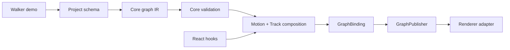

# MotionPath architecture and folder map

## v4.3 baseline

The package layout is authoritative: `packages/core` owns runtime/domain/usecases/validators/adapters/types/contract, `packages/react` owns hooks, and `apps/demo` owns routes/scenes/CSS.

The legacy `src` tree is scheduled for deletion. No compatibility bridges are allowed. Cleanup work must replace bridge files with real package implementations, update all imports and build entrypoints, then delete `src` runtime files while keeping only co-located tests and integration fixtures in their new owners.

## Rig graph ownership

The observation graph is a core runtime concern:

- `packages/core/src/usecases/normalizeObservationGraph.js` owns immutable graph IR and topological ordering.
- `packages/core/src/validators/` owns graph diagnostics and validation rules.
- `packages/core/src/lib/Motion.js` carries compiled graph order and exposes `composeGraph()`.
- `packages/core/src/usecases/GraphBinding.js` owns atomic runtime graph mutations and keeps live Track wiring, graph IR, and publisher metadata together.
- `packages/core/src/usecases/GraphPublisher.js` owns topological scheduling, downstream invalidation, persistent patch caching, and renderer publishing without knowing about React or DOM.
- `packages/react/src/hooks/` binds runtime instances to React lifecycle and subscribers.
- `apps/demo/src/components/Walker/` is the reference authored rig, not the owner of graph behavior.

`GraphPublisher.flush()` publishes a dirty node and its downstream closure in topological order. Idle nodes keep cached patches. Compose failures block their downstream closure and remain state-pending; publish failures retry only the failed node. Errors are collected and surfaced as `AggregateError` after the pass.

## v4.3 feature direction

The graph correctness implementation is complete across IR, validation, deterministic order, compiled composition, atomic mutation, dependent publishing, persistent caching, failure isolation, and benchmarks. Start with:

- `docs/RIG-GRAPH-GUIDE.md` for the plain-English explanation.
- `docs/RIG-GRAPH-ARCHITECTURE.md` for visual diagrams.
- `docs/V4.3-GRAPH-CORRECTNESS-PLAN.md` for the runtime contract and acceptance gates.
- `docs/API-REFERENCE.md` for public APIs and AI implementation rules.
