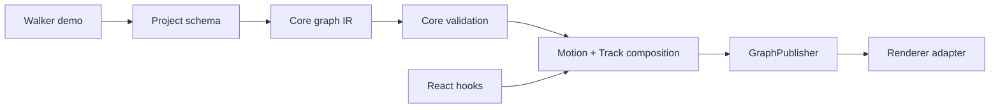

# MotionPath architecture and folder map

## v4.2 baseline

`v4.2` is the clean foundation branch. The package layout is authoritative: `packages/core` owns runtime/domain/usecases/validators/adapters/types/contract, `packages/react` owns hooks, and `apps/demo` owns routes/scenes/CSS.

The legacy `src` tree is now scheduled for deletion. No compatibility bridges are allowed in v4.2. The next cleanup PR must replace bridge files with real package implementations, update all imports and build entrypoints, then delete `src` runtime files while keeping only co-located tests and integration fixtures in their new owners.

## Rig graph ownership

The observation graph is a core runtime concern:

- `packages/core/src/usecases/normalizeObservationGraph.js` owns immutable graph IR and topological ordering.
- `packages/core/src/validators/` owns graph diagnostics and validation rules.
- `packages/core/src/lib/Motion.js` carries compiled graph order and exposes `composeGraph()`.
- `packages/core/src/usecases/GraphPublisher.js` batches dirty graph patches without knowing about React or DOM.
- `packages/react/src/hooks/` binds runtime instances to React lifecycle and subscribers.
- `apps/demo/src/components/Walker/` is the reference authored rig, not the owner of graph behavior.

## v4.2 feature direction

The rig graph implementation is complete across IR, validation, deterministic order, compiled composition, batched publishing, and benchmarks. Start with:

- `docs/RIG-GRAPH-GUIDE.md` for the plain-English explanation.
- `docs/RIG-GRAPH-ARCHITECTURE.md` for visual diagrams.
- `docs/V4.2-RIG-GRAPH-PLAN.md` for phase status.
- `docs/API-REFERENCE.md` for public APIs and AI implementation rules.
