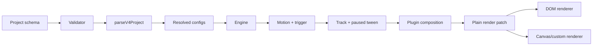
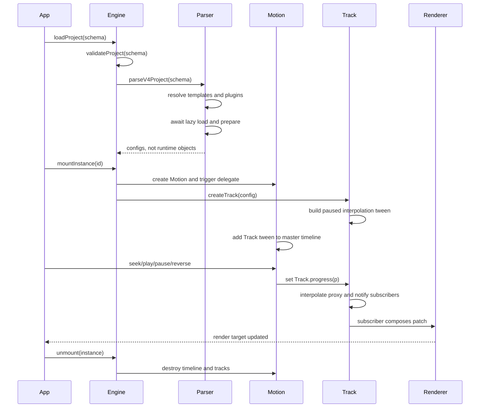
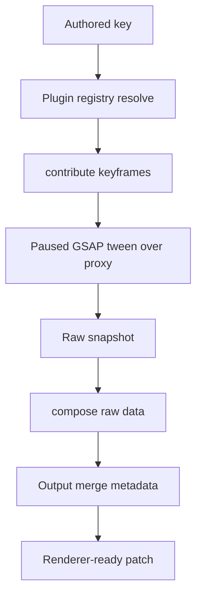
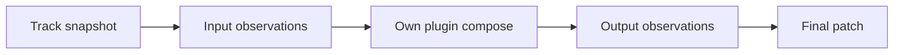
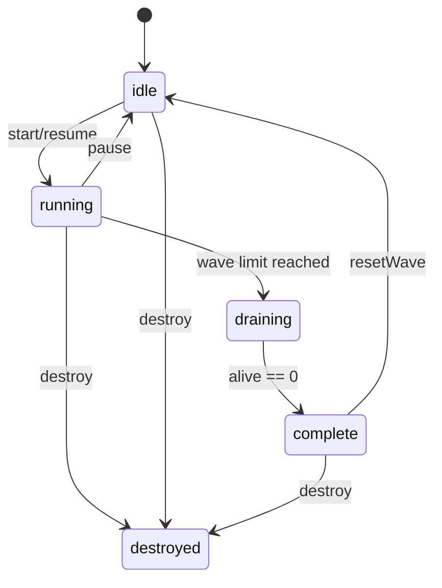

# MotionPath v4 System Guide

> The canonical onboarding document for humans and AI agents working on MotionPath v4.
>
> Read this before changing the engine. For the exact data contract, see [`src/types/motionpath.d.ts`](../src/types/motionpath.d.ts). For executable validation, see [`src/validators/`](../src/validators/).

## 1. What MotionPath is

MotionPath is a data-first animation runtime built on GSAP.

A project is JSON-like data. The runtime validates it, resolves templates, compiles each track into a paused GSAP tween over a plain JavaScript proxy, and exposes renderer-agnostic patches. React is only an integration layer for lifecycle and refs. It must not participate in the 60fps loop.

The two rules that explain almost every design choice:

1. **No React state in the frame loop.** Subscribers write to render targets directly; they do not call `setState` on every frame.
2. **The core never knows the DOM.** `Track`, `Motion`, plugins, validators, and use cases operate on data and plain objects. DOM behavior belongs in `renderers/domRenderer.js` and the subscriber hooks.

## 2. The mental model

Think of a MotionPath project as a small animation graph:

- A **Motion** owns one trigger and one master timeline.
- A **Track** owns one normalized playhead, one proxy state, one interpolation tween, and optional observations/children.
- A **Plugin** translates an authored key into compile-time tween data and frame-time output.
- A **Renderer** turns a composed patch into a target-specific side effect.



## 3. Runtime lifecycle



### Load

`Engine.loadProject()` is the trust boundary. It validates first and throws one `MotionPathValidationError` containing all fatal violations. Only after validation succeeds does parsing begin.

Parsing is intentionally separate from mounting:

- Templates are resolved into track configs.
- Plugins are discovered from keyframes.
- Lazy plugin loads are awaited once per registry.
- Plugin `prepare()` hooks are awaited before the project is returned.
- No Motion, Track, DOM node, or timeline is created during load.

### Mount

`Engine.mountInstance(id)` can mount either a Motion or a standalone Track. Motion instances are independent even when they share the same schema id. The engine gives runtime objects unique ownership handles.

`Engine.createTrackInstance(templateId, overrides)` is the preferred stamping API. It creates and adopts a runtime Track so `engine.destroy()` can clean it up. If a Track is created directly with `createTrack()`, the caller owns its teardown or must call `engine.adopt(track)`.

### Tick

The master GSAP timeline drives each Track's `progress` method. The Track's own paused tween interpolates the proxy. Subscribers receive a snapshot, compose it, and render it. The engine does not run a second animation clock.

### Destroy

Use `engine.unmount(instance)` for one object and `engine.destroy()` for the whole project. Both are intended to be idempotent. Hooks must call `engine.unmount()` rather than destroying instances directly so the Engine registry stays correct.

## 4. Schema contract

The only supported schema version is **4**.

```js
{
  schemaVersion: 4,
  projectId: 'demo',
  perspective: 1200,
  templates: [],
  motions: [],
  tracks: []
}
```

### Motion

```js
{
  id: 'cards-loop',
  trigger: { type: 'time', autoplay: false, repeat: -1 },
  stagger: 0.12,
  staggerTransition: { duration: 0.4, ease: 'power2.out' },
  tracks: [/* MotionTrack[] */]
}
```

- `id` is authoritative. Do not use `motionId` in authored schema.
- `trigger` is required.
- `stagger` is measured in seconds.
- Tracks in one Motion share the Motion's trigger.
- Legacy v3 fields such as `driver`, `timelineId`, `primary`, `lifecycle`, and `playback` are forbidden.

### Triggers

**Time** supports `repeat`, `yoyo`, `repeatDelay`, `delay`, and `autoplay`.

**Manual** is a paused timeline driven through `motion.seek(progress)`.

**Scroll** requires `scrub`. Scrubbed motions use scroll position as the playhead, so track durations and incompatible repeat/delay settings are rejected.

### Track and stops

```js
{
  id: 'card-1',
  use: 'fade-pop',
  duration: 0.9,
  keyframes: {
    opacity: { stops: [{ p: 0, v: 0 }, { p: 1, v: 1 }] }
  }
}
```

A stop has normalized progress `p` in `[0, 1]`, value `v`, and optional `ease`. Stop positions must be monotonic and unique. Missing `p: 0` or `p: 1` is warned because the proxy is seeded from the merged `0%` frame.

Progress keys are canonicalized through `toPercentKey()`. Never reintroduce raw `` `${p * 100}%` `` math in a plugin.

## 5. Plugin pipeline

Plugins have two distinct responsibilities:

| Phase   | Method         |          Frequency | Rule                                                              |
| ------- | -------------- | -----------------: | ----------------------------------------------------------------- |
| Compile | `contribute()` |     Once per Track | Pure. Converts authored stops into GSAP keyframes and tween vars. |
| Frame   | `compose()`    | Up to 60 times/sec | Cheap. Converts proxy state into a render patch.                  |



A plugin can declare:

- `keys` for exact lookup.
- `claimsKey()` for predicates such as CSS variables.
- `stage` and `priority` for deterministic ordering.
- `outputs` for merge and serialization behavior.
- `internalKeys` for proxy-only state that must never reach a renderer.
- `load()` for lazy loading.
- `prepare()` for async preflight work.

When adding a plugin, prefer `createAnimationPlugin()`, register it with the appropriate registry, and add tests for both contribution and composition. Do not edit `domRenderer` for plugin-specific behavior.

## 6. Composition and observation

A Track's `compose()` has three conceptual folds:

1. **Input observations** inject data into the raw snapshot before plugins run.
2. **Plugin composition** generates this Track's own patch.
3. **Output observations** merge another Track's patch over the result.



The `ctx` Map is created per external compose call. It uses a composing sentinel to break cycles and a resolved-entry cache to make diamonds efficient. Never persist this context across frames.

Observation is not reverse-linked. If an observed source is destroyed, remove the observation first:

```js
child.removeObserved(parent);
```

Use `role: 'input'` for data needed by this Track's plugins, such as `parentWorld` for FK. Use the default `output` role when the observed patch should override this Track's final output.

## 7. Motion controls

Application code talks to Motion, not delegates:

```js
motion.play();
motion.pause();
motion.seek(0.5);
motion.reverse();
motion.onComplete(callback);
```

The concrete trigger delegate is private to Motion. Delegates are injectable for Engine internals and direct low-level tests, but they are not an application API.

## 8. Rendering and performance

`useMotionSubscribers` keeps the latest patch for each source and flushes once per GSAP tick. `domRenderer` then:

1. Applies plugin-declared serializers.
2. Removes internal and framework-only keys.
3. Diffs against the last applied patch in a `WeakMap`.
4. Calls `gsap.set()` only when something changed.

This is why a subscriber should return a complete current patch for its source, not mutate a shared object. A stale property must be removed by omission.

The core supports renderer-agnostic patches. DOM is the built-in target; canvas, WebGL, or headless renderers should consume the same composed patch without changing Track or plugins.

## 9. Orchestration primitives

Use `Spawner` and `Overlay` instead of rebuilding lifecycle logic in a component.

- **Spawner** owns deterministic spawn policy, max alive, wave size, pause/resume, and injected-clock subscription.
- **Overlay** owns observe, animate, replace, detach, and destroy for a temporary Track.
- A Spawner clock must expose `subscribe(callback) => unsubscribe`.
- Overlay replacement invalidates stale completion callbacks through generations.



## 10. How to change the code safely

1. Read the relevant type declaration and validator rule first.
2. Add or update a focused regression test before changing behavior.
3. Preserve the layer direction: domain and use cases stay DOM-free.
4. Keep schema parsing, runtime mounting, and rendering separate.
5. Run `npm test` and `npm run typecheck`.
6. Let CI run on Node 20 and 22.
7. Prefer one focused PR over a broad cleanup.

### Layer map

```text
src/
├── domain/       Pure plugin contracts, plugin registry, property plugins
├── validators/   Executable schema rules, collect-all validation
├── usecases/     Pure compilation, composition, Spawner, Overlay
├── lib/          Stateful Motion, Track, triggers, schema parser, event bus
├── engines/      Engine ownership, loading, mounting, teardown
├── renderers/    Target-specific patch application
├── hooks/        React lifecycle and subscriber bindings
├── components/   Product/demo UI and orchestration composition
└── types/        Public TypeScript declaration contract
```

## 11. AI-agent instructions

When modifying MotionPath, an AI agent should:

- Treat `src/validators/` and `src/types/motionpath.d.ts` as the public contract.
- Treat `Engine.loadProject()` as the trust boundary.
- Never invent a v3 field or accept `motionId` as a replacement for `id`.
- Never put DOM access in `domain/`, `usecases/`, `lib/Track.js`, or `lib/Motion.js`.
- Never add a second RAF/ticker loop for scheduling.
- Never bypass Motion controls from application code.
- Never silently ignore authored schema fields; reject or implement them.
- Inspect existing tests and run the full suite before merging.

## 12. Decision log

- **Plain proxy state instead of DOM animation:** enables renderer independence and headless tests.
- **Two-level GSAP clock:** lets GSAP own scheduling and keeps repeat, yoyo, scrub, and timeScale composable.
- **Per-call composition context:** solves cycles and diamonds without cross-frame state leaks.
- **Engine ownership handles:** makes concurrent instances and stamped tracks cleanly destructible.
- **Plugin-declared metadata:** keeps merge, serialization, and internal state out of renderer conditionals.
- **Validation before parsing:** prevents malformed data from reaching GSAP or lazy plugin loading.
- **Injected Spawner clock:** makes orchestration deterministic in tests and avoids competing RAF loops.

## 13. Quick debugging map

| Symptom                           | Check first                                                            |
| --------------------------------- | ---------------------------------------------------------------------- |
| `No plugin found for key`         | Plugin registry claim and exact authored key                           |
| Motion cannot mount               | `id`, trigger type, and `loadProject()` completion                     |
| First frame is undefined          | Missing `p: 0` stop                                                    |
| Path output is wrong              | Path anchor and plugin stage/priority collisions                       |
| DOM writes are noisy              | Complete patch shape and dirty-check cache                             |
| Stale overlay output              | Remove observation and replace Overlay generation                      |
| Memory grows after navigation     | `engine.unmount()` in hook cleanup and adopted Track ownership         |
| CI fails only in one Node version | Reproduce locally with clean `npm ci` and the pinned typecheck command |

## 14. Verification checklist

- `npm test`
- `npm run typecheck`
- Load a valid v4 fixture through Engine.
- Mount a time, manual, and scroll Motion.
- Seek a manual Motion and assert Track progress.
- Compose a cycle and a diamond observation graph.
- Render a patch twice and assert the second DOM write is skipped.
- Destroy adopted Tracks and assert Engine ownership is empty.
- Destroy a Spawner and assert its clock subscription is removed.
