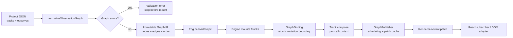
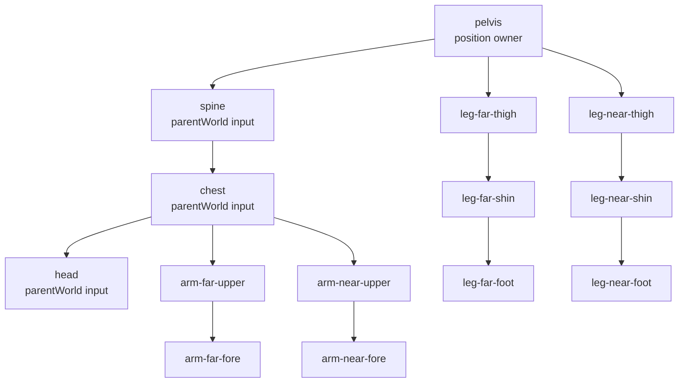
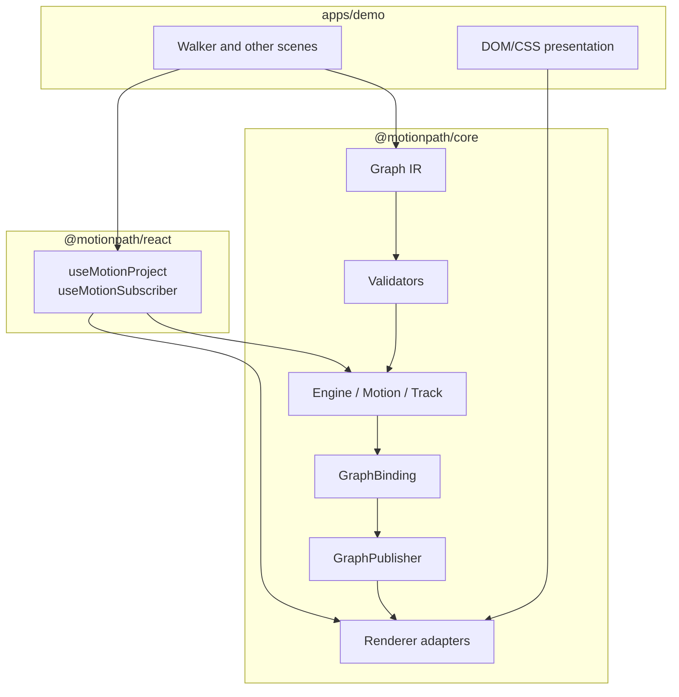
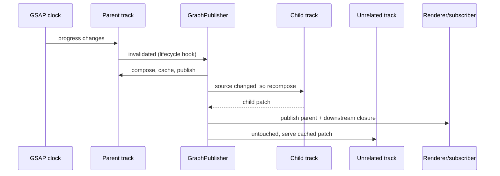
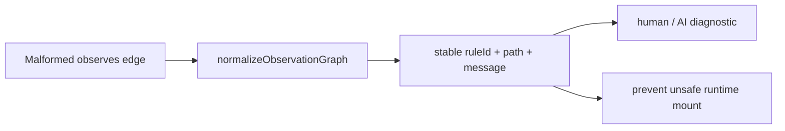

# Rig graph architecture report

This report shows the data flow from authored schema to a rendered DOM patch. It is intentionally visual so a new developer or AI agent can understand ownership without reading the whole engine.

## End-to-end flow

## Walker example

The arrows mean “must be composed before.” They do not mean “copy coordinates.” A child receives its parent’s composed world patch and then applies its own authored local data.

They also mean “must be republished together.” Marking `pelvis` dirty publishes every bone downstream of it, not just `pelvis`.

## Ownership map

Core owns graph meaning and composition. React owns lifecycle bindings. The demo owns authored scenes and presentation. No graph logic belongs in CSS or React state.

Within core the split is deliberate: **Track** owns live edges and per-call composition, **GraphBinding** owns the transaction that moves Track wiring and publisher metadata together or not at all, and **GraphPublisher** owns topological scheduling, invalidation, and the cross-flush patch cache.

## Per-frame mental model

Three things this diagram is making explicit, because earlier docs implied the publisher only ordered work:

1. Marking is O(1) and invalidation propagates forward to dependents during `flush()`. Callers never enumerate the closure themselves.
2. Idle nodes are not recomposed. The cache is the publisher's, held across flushes.
3. One node failing does not abort the frame. Failures are collected and thrown as a single `AggregateError` after the pass, and a publish failure retries only that node.

`GraphPublisher` is framework-agnostic. It does not know about React, DOM, or GSAP rendering details. That separation is deliberate: the same graph can feed DOM, canvas, testing, or AI inspection tools.

## Diagnostics model

Useful rule IDs include `track-observations`, `track-observations-cycle`, `track-observations-duplicate-node`, and `track-observations-duplicate-edge`.

Runtime mutations are diagnosed the same way. `GraphBinding` normalizes a candidate graph before committing, so a rejected `addEdge` reports the same rule IDs and leaves the previous graph, the live Track wiring, and the publisher order untouched.
