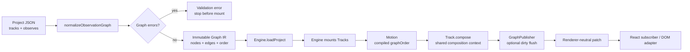
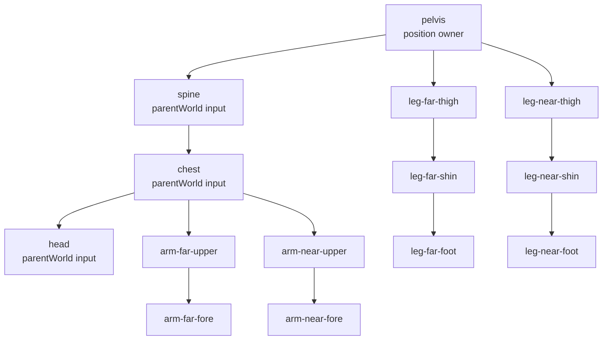
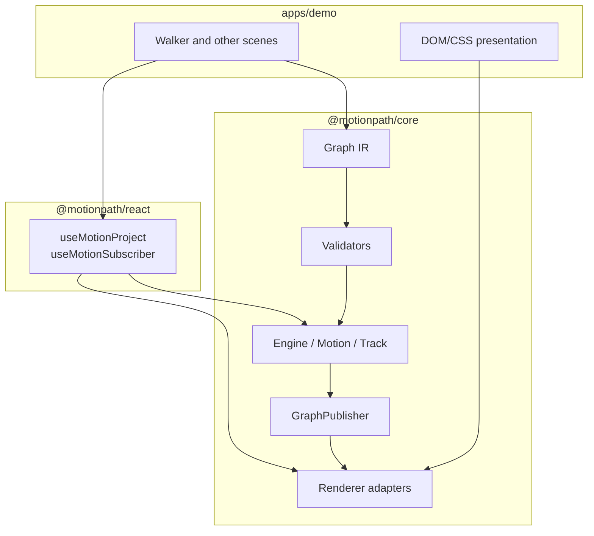
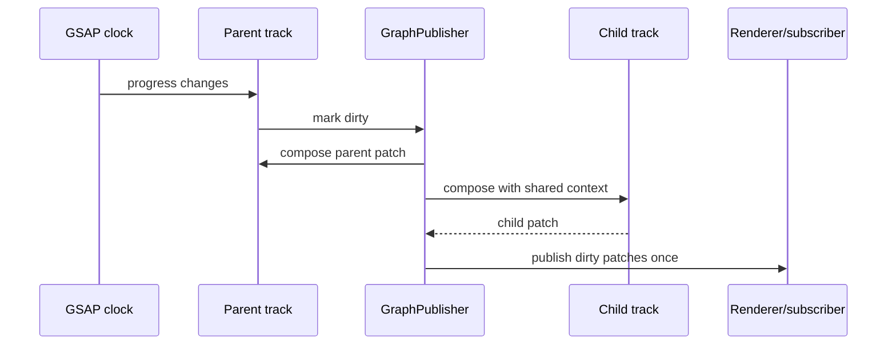
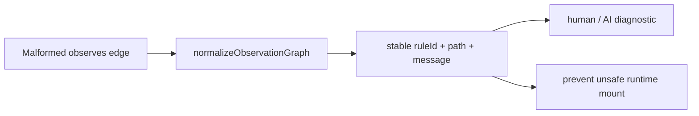

# Rig graph architecture report

This report shows the data flow from authored schema to a rendered DOM patch. It is intentionally visual so a new developer or AI agent can understand ownership without reading the whole engine.

## End-to-end flow

## Walker example

The arrows mean “must be composed before.” They do not mean “copy coordinates.” A child receives its parent’s composed world patch and then applies its own authored local data.

## Ownership map

Core owns graph meaning and composition. React owns lifecycle bindings. The demo owns authored scenes and presentation. No graph logic belongs in CSS or React state.

## Per-frame mental model

`GraphPublisher` is framework-agnostic. It does not know about React, DOM, or GSAP rendering details. That separation is deliberate: the same graph can feed DOM, canvas, testing, or AI inspection tools.

## Diagnostics model

Useful rule IDs include `track-observations`, `track-observations-cycle`, `track-observations-duplicate-node`, and `track-observations-duplicate-edge`.
