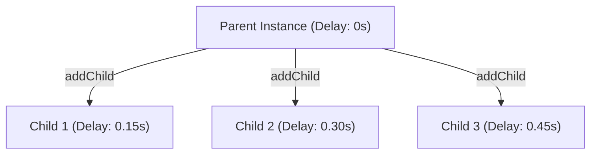

# Conceptual Guide: Dynamic Lazy Stagger & Child Lifecycle in MotionPath

This document explains the problem of staggered animations in a decoupled, lazy-instance-based architecture and details the engine-level solution implemented in [MotionInstance.js](file:///d:/dev/motionpath/src/lib/MotionInstance.js) using the `addChild()` and `removeChild()` pipeline.

---

## 1. The Core Problem

In traditional animation engines (like raw GSAP), **staggering**—playing sequence elements one after another with a fixed time offset—is resolved eagerly. The engine expects a static array of elements or selectors (e.g., `.card`) present in the DOM during initialization.

```
GSAP Stagger (Eager/Coupled)
[Card 1, Card 2, Card 3] ──(init)──> Apply offsets: [0.0s, 0.15s, 0.30s]
```

However, MotionPath uses a **Decoupled Lazy Instance Model** where:
1. **Unknowable Cardinality**: The number of children (e.g., dynamically rendered items in a React `.map()`) is determined entirely at runtime based on application state.
2. **Delayed Mounts (Lazy Initialization)**: Components mount incrementally. The engine cannot know the final item count when the parent is initialized.
3. **No Direct DOM Queries**: The core engine is decoupled from the DOM. It cannot query elements to compute lengths or index order.
4. **Dynamic Removals**: Items can be removed mid-playback (e.g., deleting a card from a carousel). Leaving the remaining items at their original offset leaves awkward "gaps" in the animation flow, while snapping them instantly causes a jarring visual jump.

---

## 2. The Solution: Dynamic Child Registries & Parent Anchoring

To solve this, MotionPath leverages a **Parent-Child Instance Hierarchy** managed dynamically via [MotionInstance](file:///d:/dev/motionpath/src/lib/MotionInstance.js). 

Instead of treating the stagger list as a flat group, the first element (or a dedicated controller instance) acts as the **Parent Anchor**. Subsequent elements are mounted lazily as **Children** that bind to the parent.



### Key Principles:
1. **Schema-Defined Spacing, Runtime Delay**: The designer defines a single, static `stagger` offset in the JSON schema (e.g., `stagger: 0.15`). The engine then computes delay dynamically at runtime.
2. **Unified Playhead Control**: The parent timeline is the single source of truth. When the parent is seeked (e.g., by a scroll scrub), it pushes its local time down to all children, adjusting for their individual offsets.

---

## 3. Implementation Details

The solution is implemented in [MotionInstance.js](file:///d:/dev/motionpath/src/lib/MotionInstance.js) via three main mechanisms:

### A. Lazy Addition (`addChild`)
When React mounts a child component, it calls `addChild()` on the parent. 
1. The engine reads the `stagger` value from the parent's schema.
2. The delay is calculated using the child's index in the `children` array:
   $$\text{calculatedDelay} = \text{childIndex} \times \text{stagger}$$
3. The parent timeline's duration is padded by adding an empty callback at the child's end time:
   $$\text{childEndTime} = \text{calculatedDelay} + \text{childDuration}$$
   This ensures ScrollTrigger/scrubbing accounts for the dynamic length of the entire list.

### B. Dynamic Playhead Projection
On every update of the parent's timeline, it projects the local playhead time down to its children:

$$\text{childTime} = \text{parentTime} - \text{childDelay}$$
$$\text{childProgress} = \text{clamp}\left(0, 1, \frac{\text{childTime}}{\text{childDuration}}\right)$$

The child is then driven to `childProgress` using `child.seek()`.

### C. Gaps Collapsing and Smooth Re-stagger (`removeChild`)
When a child is removed (e.g., unmounted or deleted), simply shifting children's delays instantly would cause a visual jump. To avoid this, [MotionInstance.js](file:///d:/dev/motionpath/src/lib/MotionInstance.js#L190-L226) uses a **GSAP-powered smooth re-stagger**:

1. The target child is spliced out of the parent's `children` array.
2. The padding callback is removed from the timeline.
3. For all remaining children, the engine computes a new index and target delay (`newIdx * stagger`).
4. Rather than hard-setting the new delay, the engine runs a **GSAP tween** that interpolates each child's `currentDelay` to `newDelay` over `0.6` seconds (`ease: 'power2.out'`).
5. On update of the tween, the playhead projection is re-run for that child, creating a smooth visual transition as cards glide into their new slots.

```
[Card 1]            [Card 2]            [Card 3] (Removed)
Delay: 0.0s         Delay: 0.15s        Delay: 0.30s
       │                   │
       ▼ (Spliced & destroyed)
[Card 1]            [Card 2] ──(Glide into place)──> New Delay: 0.15s
Delay: 0.0s         Delay: 0.15s (interpolated smoothly from 0.30s)
```

---

## 4. Code References

### Child Mount Logic
From [MotionInstance.js:addChild](file:///d:/dev/motionpath/src/lib/MotionInstance.js#L151-L188):
```js
const stagger = this.schemaMotion.stagger ?? this.schemaMotion.driver?.stagger ?? 0;
const childIndex = this.children.length;
const calculatedDelay = targetConfig.delay ?? (childIndex * stagger);

const child = this.deps.mountInstance(targetMotionId, {
  ...targetConfig,
  delay: calculatedDelay,
  parentId: this.id
});

child.currentDelay = calculatedDelay;
this.children.push(child);

// Pad parent timeline duration to encompass child animations
const childDuration = child.timeline.duration() || 1.0;
const childEndTime = calculatedDelay + childDuration;
const paddingCb = () => {};
child.paddingCallback = paddingCb;
this.timeline.add(paddingCb, childEndTime);
```

### Collapsing Gaps Logic
From [MotionInstance.js:removeChild](file:///d:/dev/motionpath/src/lib/MotionInstance.js#L190-L226):
```js
const idx = this.children.indexOf(child);
if (idx !== -1) {
  this.children.splice(idx, 1);
  if (child.paddingCallback) {
    this.timeline.remove(child.paddingCallback);
  }
  child.destroy();

  // Smoothly animate currentDelay for remaining children using GSAP
  const stagger = this.schemaMotion.stagger ?? this.schemaMotion.driver?.stagger ?? 0;
  this.children.forEach((c, newIdx) => {
    const newDelay = newIdx * stagger;
    if (c.currentDelay === undefined) {
      c.currentDelay = c.config.delay || 0;
    }
    if (c.delayTween) c.delayTween.kill();
    c.delayTween = gsap.to(c, {
      currentDelay: newDelay,
      duration: 0.6,
      ease: 'power2.out',
      onUpdate: () => {
        const parentTime = this.timeline.time();
        const childDuration = c.timeline.duration() || 1.0;
        const childTime = parentTime - c.currentDelay;
        const childProgress = Math.max(0, Math.min(1, childTime / childDuration));
        c.seek(childProgress);
      }
    });
  });
}
```

---

## 5. React Integration Pattern

In components like [DemoPage.jsx](file:///d:/dev/motionpath/src/components/Demo/DemoPage.jsx#L398-L434), the dynamic relationship is managed using React state and engine hooks:

```jsx
function DynamicList({ parentInstance }) {
  const [items, setItems] = useState(MOCK_ITEMS);
  const childMap = useRef(new Map());

  // Mount/Get instance for each item
  const getChildInstance = (itemId) => {
    if (childMap.current.has(itemId)) {
      return childMap.current.get(itemId);
    }
    const child = parentInstance.addChild();
    childMap.current.set(itemId, child);
    return child;
  };

  // Remove item dynamically
  const handleRemove = (itemId, childInstance) => {
    parentInstance.removeChild(childInstance);
    childMap.current.delete(itemId);
    setItems(prev => prev.filter(item => item.id !== itemId));
  };

  return (
    <div className="list-container">
      {items.map(item => (
        <ListItem 
          key={item.id} 
          instance={getChildInstance(item.id)} 
          onRemove={(inst) => handleRemove(item.id, inst)} 
        />
      ))}
    </div>
  );
}

---

## 6. Architectural Decision: Constant Scroll Speed by Default

In creative scrollytelling, **visual pacing** is critical. If the scroll speed (the amount of visual animation movement per pixel of scrolling) shifts dynamically as items are added or removed, it harms the user experience by making the scroll feel unstable and inconsistent.

Therefore, MotionPath enforces **Proportional Scroll Range Scaling by Default** when handling stagger additions:

### A. Proportional DOM Scaling
For DOM-relative triggers (e.g. `end: "bottom bottom"`), the outer scene wrapper container MUST be styled with `height: auto` or dynamic height.
* When child components mount, the container expands physically.
* The engine triggers `ScrollTrigger.refresh()`.
* ScrollTrigger measures the new bottom, extending the scroll pin region proportionally.

### B. Proportional Pixel Translation
For pixel-relative definitions (e.g. `end: "+=2000"`), the engine translates the static string into a dynamic timeline-dependent evaluation function under the hood:
```js
end: () => `+=${timeline.duration() * pixelsPerSecond}`
```
This ensures that the scroll height budget scales at a constant rate of pixels-per-animation-second, keeping the scroll speed completely uniform.

### C. Rejection of Fixed-Budget Compression
Compacting animations to fit a static scroll range (Case 3) is rejected as a default behavior. It causes active animations to run faster or slower depending on the number of loaded items. It is only supported as an opt-in fallback when layouts are strictly constrained by page-height limitations.

---

## 7. Rationale: Why Raw GSAP Stagger Fails for Dynamic Lists

Using GSAP's native `stagger` utility (e.g. `gsap.to(".card", { stagger: 0.14 })`) inside dynamic list components like a React carousel creates two severe engineering bottlenecks:

1. **Eager Evaluation (The Addition Jump)**: GSAP stagger is calculated statically at initialization. If a new card mounts mid-scroll, the animation timeline has no knowledge of it. To add it, the developer must destroy and rebuild the entire timeline from scratch. Re-evaluating the timeline mid-scroll causes the scrubbed playhead to reset or shift, triggering a jarring visual snap for all elements.
2. **Baked-in Offsets (The Removal Snap)**: In a single raw GSAP stagger tween, individual delays are compiled into static timeline keyframe positions and cannot be individually manipulated. If a card is removed, the remaining cards snap instantly to their new stagger index positions. In contrast, by using independent `MotionInstance` objects, we can target each card's delay property and smoothly interpolate it (`gsap.to(child, { currentDelay: targetDelay, duration: 0.6 })`), causing remaining cards to glide gracefully into place.

---

## 8. Real-World Use Cases for Dynamic Stagger

While static lists (like a 3-card pricing table) can simply be pre-rendered and kept in the DOM, dynamic lazy stagger is essential for the following high-end creative layout types:

* **Infinite Scroll Storytelling**: Layouts that fetch cards or event nodes from a database as the user scrolls down (paginated portfolios, historical timelines). Newly fetched items are appended to the scroll-track on the fly without resetting the scroll position or the playhead of cards already in view.
* **Interactive Product Builders**: Layouts where users dynamically select configuration options (e.g. custom car models, custom keyboards). The chosen parts stagger onto the screen along a curved path in real time as the user configures them.
* **High-Performance DOM Recycling**: Lists that require constant mounting and unmounting of DOM nodes to maintain consistent frame rates (see Section 9 below).

---

## 9. DOM Virtualization (Unmounting) vs. CSS Hiding (`display: none`)

A common question is whether performance bottlenecks can be solved by keeping all elements mounted and simply hiding offscreen cards with CSS (`display: none` or `visibility: hidden`). While CSS hiding saves *paint* time, it fails to solve the critical CPU and memory overheads of long lists:

* **DOM Tree Size (Memory)**: Hidden DOM nodes still consume browser RAM. For large lists, hundreds of hidden DOM elements with nested images/text quickly cause mobile browsers (like Safari on iOS) to drop frames or crash.
* **Virtual DOM Reconciliation**: When the state changes, modern JS frameworks (React, Vue) must traverse and diff all mounted components. Having hundreds of hidden items forces the framework to do wasted CPU diffing cycles on invisible elements.
* **Active Scripting Overhead**: If hidden components remain mounted, the animation engine must continue updating their coordinate proxies and keyframe interpolations on every frame, wasting CPU cycles on invisible computations.
* **The Solution**: **DOM Virtualization** (retaining only 5–8 active cards in the DOM) combined with the engine's dynamic `addChild` / `removeChild` lifecycle keeps memory, CPU usage, and diffing cycles completely flat, ensuring a stable **60FPS** experience on all hardware.

---

## 10. The `useDynamicHeight` Module (Overriding Hardcoded CSS Heights)

When the container height is hardcoded in a stylesheet (e.g. `.carousel-scene { height: 300vh; }`), calling `ScrollTrigger.refresh()` has no effect because the DOM height remains fixed. This fixed range causes playhead jumps when the timeline duration changes.

To solve this without forcing developers to change their CSS stylesheets, we created the modular React hook [useDynamicHeight.js](file:///d:/dev/motionpath/src/hooks/useDynamicHeight.js) which operates as a localized DOM-height controller.

### A. How the Hook works:
1. **Initial Measurement**: On mount, it measures the trigger container's initial computed pixel height ($H_{\text{initial}}$) and the browser window's height ($V$).
2. **Scroll Speed Calculation**: It calculates the initial scrollable range ($H_{\text{initial}} - V$) and maps it to the initial timeline duration ($T_{\text{initial}}$) to compute a scroll speed in pixels-per-second:
   $$\text{pixelsPerSecond} = \frac{H_{\text{initial}} - V}{T_{\text{initial}}}$$
3. **Engine Subscriptions**: The hook registers a listener using the engine's [onChildChange](file:///d:/dev/motionpath/src/lib/MotionInstance.js#L85-L89) event.
4. **Dynamic Overrides**: When a card is added/removed (modifying $T_{\text{current}}$), the hook calculates the new container height:
   $$H_{\text{new}} = (T_{\text{current}} \times \text{pixelsPerSecond}) + V$$
   It directly applies this inline to the trigger element's style:
   ```javascript
   element.style.height = `${newHeight}px`;
   ```
5. **ScrollTrigger Update**: The hook's update triggers the native `ScrollTrigger.refresh()` call, forcing GSAP to re-evaluate the scrollbounds based on the inline style override.

### B. Why this is highly optimized:
* **No GSAP Recreation**: The timeline, tweens, and ScrollTrigger objects are never destroyed or re-created. Only the boundaries are updated, keeping page scroll perfectly smooth.
* **Decoupled Architecture**: The core engine remains completely unaware of CSS layout properties, which is critical for porting to non-web platforms (like React Native or Flutter) that do not use web CSS.
* **Aesthetic Preservation**: It allows designers to define clean, static-looking mock scenes in CSS/JSON, while the hook dynamically ensures they are appendable at runtime.


```
