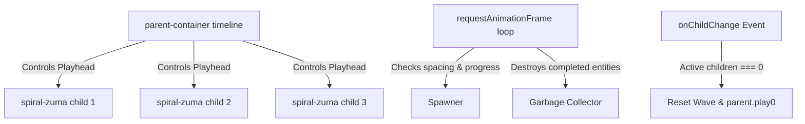

# Zuma Spiral Flow

An endless Zuma-style wave-spawner demo showcasing parent-child timeline nesting, native GSAP stagger reflow, and high-performance DOM transformations using the MotionPath Engine.

---

## 📖 Table of Contents
1. [Architecture & Flow](#-architecture--flow)
2. [Uniform Path Geometry](#-uniform-path-geometry)
3. [Linear Speed Progression](#-linear-speed-progression)
4. [Wave-Based Game Loop (rAF)](#-wave-based-game-loop-raf)
5. [Event-Driven Reset (`onChildChange`)](#-event-driven-reset-onchildchange)
6. [Declarative Sizing Schema](#-declarative-sizing-schema)

---

## 🏗️ Architecture & Flow

The Zuma Spiral utilizes a parent-child timeline structure to achieve smooth and mathematically perfect ball queue management:



---

## 📐 Uniform Path Geometry

An Archimedean spiral has a radius $r$ that decreases linearly with the angle $\theta$:
$$r(\theta) = R_{\text{outer}} - k \theta$$

By default, generating coordinates at linear angular steps ($\Delta \theta$) causes points to cluster tightly near the center and stretch wide at the outer edge, making constant-speed propagation impossible.

To fix this:
1. A high-resolution raw spiral of $2,000$ points is generated.
2. The cumulative physical distance (arc length) is measured segment-by-segment.
3. The path is re-sampled to create exactly $200$ uniform segments where the distance between any two adjacent coordinates is a constant step size of $\approx 20.5\text{px}$.

---

## 🏃 Linear Speed Progression

By default, GSAP applies a decelerating ease (`power1.out`) to keyframe interpolations. In a Zuma game, this deceleration makes balls cluster and overlap at the start of the path.

To keep speed constant along the path without modifying the engine library, we set `ease: 'none'` directly inside the track schema stops configuration:

```javascript
      path: {
        points: spiralPathPoints,
        stops: [{ p: 0, v: 0 }, { p: 1, v: 1, ease: 'none' }],
      }
```

This enforces a perfectly linear progression:
$$\text{distance}(t) = v \cdot t$$
This allows us to accurately infer the progress checks (`MIN_SPAWN_PROGRESS`) and stagger delay intervals directly from the physical size of the balls.

---

## 🔄 Wave-Based Game Loop (rAF)

The spawner runs on a native browser `requestAnimationFrame` paint loop, clean of react state renders, split into two specific concerns:

### 1. Spawning (The Spawner)
* **Goal**: Launch balls in a tight, touching chain from the outer tip of the spiral.
* **Logic**: Only spawns if the count of balls launched in the current wave is less than $30$. Spawns a new ball if no preceding ball exists, or if the last launched ball has progressed past the center-to-center spacing threshold:
  $$\text{MIN\_SPAWN\_PROGRESS} = \frac{\text{BALL\_SIZE}}{\text{totalPathLength}}$$

### 2. Unspawning (The Garbage Collector)
* **Goal**: Safely clean up and destroy entities that enter the black hole.
* **GSAP Nesting Limitation**: In GSAP, when child timelines are nested inside a parent timeline, the child's `onComplete` callback does not reliably trigger because their playheads are governed by the parent.
* **Fix**: The loop scans active ball timelines at 60fps. When a ball's progress reaches $\ge 0.999$ (swallowed), it automatically triggers `handleAutoRemove(id, inst)`, removing the ball from React state and calling `containerInstance.removeChild(inst)` on the engine.

---

## 🔔 Event-Driven Reset (`onChildChange`)

Rather than polling the active counts on every frame, we subscribe to the engine's built-in event listener `onChildChange` to manage wave resets:

```javascript
    const unsubscribe = containerInstance.onChildChange(() => {
      if (containerInstance.children.length === 0 && spawnedCount.current > 0) {
        spawnedCount.current = 0;
        containerInstance.timeline.play(0);
      }
    });
```

* When all balls are cleared (popped by clicks or swallowed by the black hole), `children.length` becomes `0`.
* The callback resets `spawnedCount.current` to `0` and forces the parent timeline back to time `0` using `.play(0)`.
* Moving the playhead back to `0` is critical because GSAP completes and pauses the parent timeline at the end of the first wave; calling `.play(0)` resumes the playhead so that the next wave's balls play correctly from the outer edge.

---

## 📐 Declarative Sizing Schema

Sizing is completely decoupled from inline React styles and CSS class lookups by using a declarative `--ball-size` CSS variable track in the motion schemas:

```javascript
      '--ball-size': {
        stops: [
          { p: 0, v: `${BALL_SIZE}px` },
          { p: 1, v: `${BALL_SIZE}px` }
        ]
      }
```

The engine's native `cssVarPlugin` automatically captures this variable, composes the patch, and applies it straight to the DOM ref. This variable is registered in both `spiralZumaScene` and `ballExitScene` to ensure the ball preserves its correct size when transitioning into pop animations.
