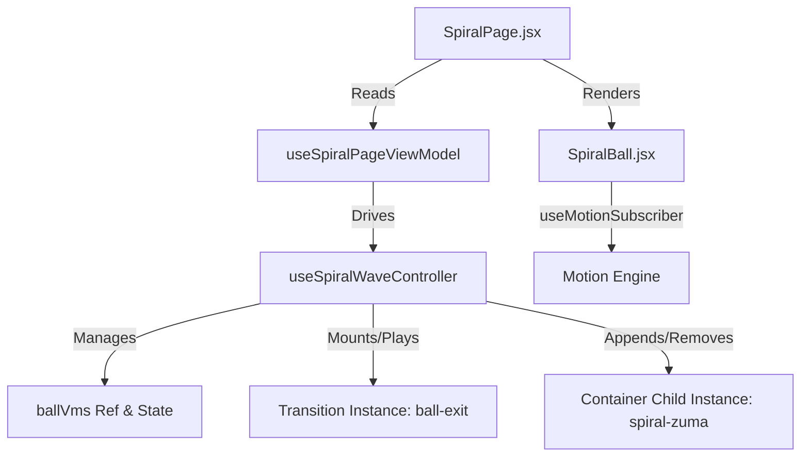
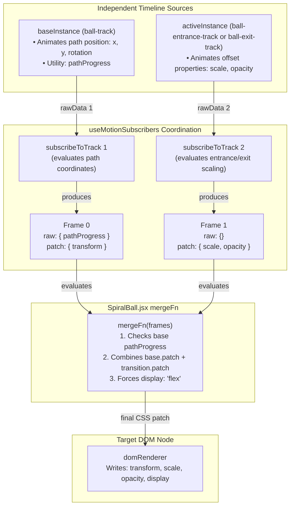

# Zuma Spiral Flow

An endless Zuma-style wave-spawner demo showcasing parent-child timeline nesting, native GSAP stagger reflow, and high-performance DOM transformations using the MotionPath Engine.

---

## 📖 Table of Contents
1. [Architecture & Flow](#-architecture--flow)
2. [Uniform Path Geometry](#-uniform-path-geometry)
3. [Linear Speed Progression](#-linear-speed-progression)
4. [Wave-Based Game Loop (rAF)](#-wave-based-game-loop-raf)
5. [Wave Reset & Playhead Re-anchoring](#-wave-reset--playhead-re-anchoring)
6. [Declarative Sizing Schema](#-declarative-sizing-schema)
7. [Multi-Source Subscription & Composition](#-multi-source-subscription--composition)

---

## 🏗️ Architecture & Flow

The Zuma Spiral uses a **ViewModel-driven architecture** (MVVM/Controller pattern) to cleanly decouple the motion engine's lifecycle, the game logic, and React presentational rendering:

| Layer | Responsibility | File |
|---|---|---|
| **Config & Constants** | Static properties (dimensions, colors, speeds) | [spiralConfig.js](file:///d:/dev/motionpath/src/components/Spiral/spiralConfig.js) |
| **Path Geometry** | Archimedean spiral generation and uniform segment spacing math | [spiralPath.js](file:///d:/dev/motionpath/src/components/Spiral/spiralPath.js) |
| **Motion Schemas** | Factory schemas for parent timelines, path followers, and transitions | [spiralMotions.js](file:///d:/dev/motionpath/src/components/Spiral/spiralMotions.js) |
| **Controller Hook** | Synchronous queue management, wave loops, and transition lifecycles | [useSpiralWaveController.js](file:///d:/dev/motionpath/src/components/Spiral/useSpiralWaveController.js) |
| **ViewModel Adapter** | Page-facing data coordinator | [useSpiralPageViewModel.js](file:///d:/dev/motionpath/src/components/Spiral/useSpiralPageViewModel.js) |
| **View Page** | Presentational wrapper holding SVG structures and static scene details | [SpiralPage.jsx](file:///d:/dev/motionpath/src/components/Spiral/SpiralPage.jsx) |
| **View Entity** | Motion subscriber bound to the VM's active instance and track | [SpiralBall.jsx](file:///d:/dev/motionpath/src/components/Spiral/SpiralBall.jsx) |

### Spawning & Transition Flow



1. **Spawn**: `useSpiralWaveController` appends a child instance to the container and wraps it in a `BallVm` object.
2. **Entrance**: The controller mounts and plays a temporary entrance transition instance, pointing the VM's `activeInstance` to it to update the subscriber.
3. **Active Path**: Upon entrance completion, the temporary instance is destroyed and the VM restores `activeInstance` to the base path-travel instance.
4. **Exit/Pop**: On click or when reaching the center, the controller mounts an exit instance, transitions the subscriber, removes the base instance from the parent, and clears the VM from state.

---

## 📐 Uniform Path Geometry

An Archimedean spiral has a radius $r$ that decreases linearly with the angle $\theta$:
$$r(\theta) = R_{\text{outer}} - k \theta$$

By default, generating coordinates at linear angular steps ($\Delta \theta$) causes points to cluster tightly near the center and stretch wide at the outer edge, making constant-speed propagation impossible.

To fix this:
1. A high-resolution raw spiral of $2,000$ points is generated.
2. The cumulative physical distance (arc length) is measured segment-by-segment.
3. The path is re-sampled to create exactly $200$ uniform segments where the distance between any two adjacent coordinates is a constant step size of $\approx 20.5\text{px}$.

---

## 🏃 Linear Speed Progression

By default, GSAP applies a decelerating ease (`power1.out`) to keyframe interpolations. In a Zuma game, this deceleration makes balls cluster and overlap at the start of the path.

To keep speed constant along the path without modifying the engine library, we set `ease: 'none'` directly inside the track schema stops configuration:

```javascript
      path: {
        points: spiralPathPoints,
        stops: [{ p: 0, v: 0 }, { p: 1, v: 1, ease: 'none' }],
      }
```

This enforces a perfectly linear progression:
$$\text{distance}(t) = v \cdot t$$
This allows us to accurately infer the progress checks (`MIN_SPAWN_PROGRESS`) and stagger delay intervals directly from the physical size of the balls.

---

## 🔄 Wave-Based Game Loop (rAF)

The spawner runs on a native browser `requestAnimationFrame` paint loop, clean of React state renders.

### 1. Spawning (The Spawner)
* **Goal**: Launch balls in a tight, touching chain from the outer tip of the spiral.
* **Logic**: Only spawns if the count of balls launched in the current wave is less than $30$. Spawns a new ball if no preceding ball exists, or if the last launched ball has progressed past the center-to-center spacing threshold:
  $$\text{MIN\_SPAWN\_PROGRESS} = \frac{\text{BALL\_SIZE}}{\text{totalPathLength}}$$

### 2. Event-Driven Unspawning (The Garbage Collector)
* **Goal**: Safely clean up and destroy entities that enter the black hole or get clicked.
* **Mechanism**: On-complete events are fully reliable due to the engine's correct playhead sync and predecessor-anchored spawn placement (which avoids cascade reflow drift). When a ball finishes its path, its event-driven `onComplete` callback fires immediately, triggering `startExit(id)` which mounts the exit transition instance, updates the subscriber, removes the base instance from the container using `containerInstance.removeChild(latest.baseInstance)`, and removes the VM from state.

---

## 🔄 Wave Reset & Playhead Re-anchoring

Wave resets are evaluated directly inside the controller's spawner tick loop when spawning completes:

```javascript
      if (spawnedCountRef.current < 30) {
        // Spawning logic...
      } else if (containerInstance.children.length === 0) {
        spawnedCountRef.current = 0;
        containerInstance.timeline.play(0);
      }
```

* When all balls are cleared (popped by clicks or swallowed by the black hole), `children.length` becomes `0`.
* The tick loop detects this, resets `spawnedCountRef.current` to `0`, and forces the parent timeline back to time `0` using `.play(0)`.
* Replaying from `0` is critical because GSAP completes and pauses the parent timeline at the end of a wave; calling `.play(0)` resumes the playhead so that the next wave's balls play correctly from the outer edge.

---

## 📐 Declarative Sizing Schema

Sizing is completely decoupled from inline React styles and CSS class lookups by using a declarative `--ball-size` CSS variable track in the motion schemas:

```javascript
      '--ball-size': {
        stops: [
          { p: 0, v: `${BALL_SIZE}px` },
          { p: 1, v: `${BALL_SIZE}px` }
        ]
      }
```

The engine's native `cssVarPlugin` automatically captures this variable, composes the patch, and applies it straight to the DOM ref. This variable is registered in both `spiralZumaScene` and `ballExitScene` to ensure the ball preserves its correct size when transitioning into pop animations.

---

## 🔗 Multi-Source Subscription & Composition

During entrance and exit transitions, a ball follower requires inputs from **two independent timelines**:
1. The **base timeline** (`ball-track`) providing the latest $x$, $y$, and $rotation$ coordinates along the spiral.
2. The **transition timeline** (`ball-entrance-track` or `ball-exit-track`) providing scale, opacity, and custom offset animations.

Instead of writing to the DOM via two independent, racing hooks, `SpiralBall.jsx` binds to both timelines using `useMotionSubscribers(sources, ref, mergeFn)`:



### The Frame-Object Contract
To prevent raw coordinate metadata (e.g. `pathProgress`) from leaking into final DOM patches (which violates boundaries and can cause visual bugs), the hook operates on **Frames** rather than flat patches:
```javascript
// Each frame yield contains:
{
  raw: rawData,  // Raw unprocessed track values (e.g. pathProgress)
  patch: patch   // Composed renderer-ready CSS properties
}
```

### The Merge Logic
The consumer's custom `mergeFn` receives an array of these frame objects and dynamically decides how to combine them:

```javascript
const mergeFn = useCallback((frames) => {
  const base = frames[0];
  const transition = frames[1]; // Present only during entrance/exit states

  const p = base.raw?.pathProgress ?? 0;

  // 1. Single Source: Normal path travel (checks boundary on raw data)
  if (!transition && (p <= 0 || p >= 1)) {
    return { display: 'none', opacity: 0 };
  }

  // 2. Dual Source: Spawning/Exiting (forces display flex, merges base path + transition offsets)
  if (transition) {
    return { ...base.patch, ...transition.patch, display: 'flex' };
  }

  return { ...base.patch, display: 'flex' };
}, []);
```

This keeps the engine's core hook focused solely on subscription coordination, while leaving the layout-level decision of when and how to compose patches entirely to the consumer.
